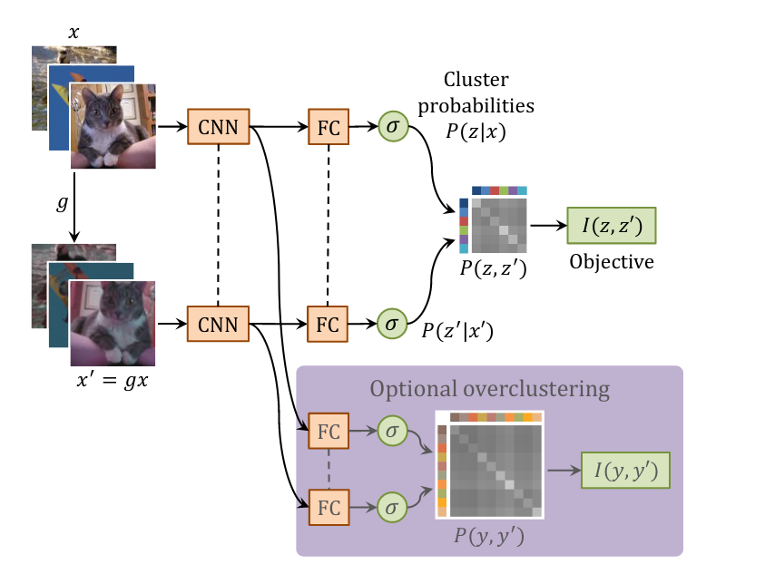

# Keras implementation of Invariant Information Clustering 

## How does it work
Python implementation clustering approach according to [Ji et al.](https://arxiv.org/pdf/1807.06653.pdf). The architecture of the neural network is shown here:

*Figure taken from [Ji et al.](https://arxiv.org/pdf/1807.06653.pdf)*

The training objective of the clustering approach is to maximize the mutual information between the input image X and a transformed image X' = g(X). Here, g(X) represents a random transformation (e.g. rotation, cropping, change in brightness) of image X. 

## Setup

